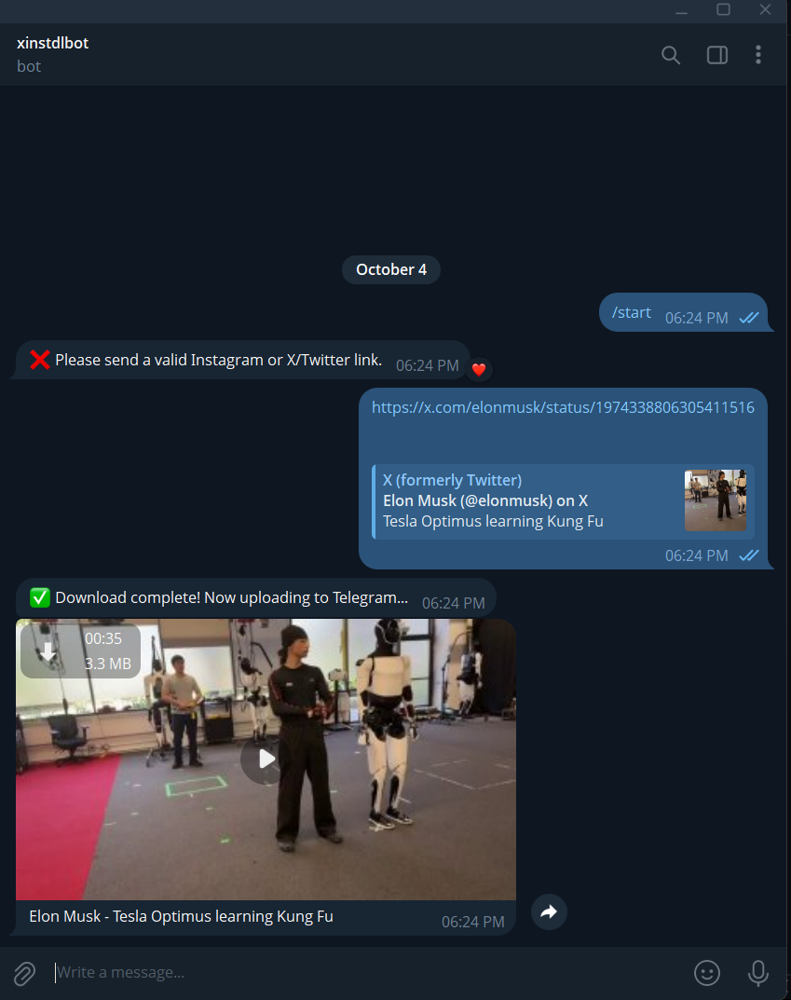

# XInstDL

A fast and elegant Telegram bot for downloading media from X (Twitter) and Instagram(or more). Simply send a link and get the video delivered straight to your Telegram chat!

## Features

- **Multi-platform support**: Download from X (Twitter) and Instagram (and more)
- **Fast downloads**: Powered by `ytdlp-nodejs` for efficient media extraction
- **Easy to use**: Just send a link to the bot
- **Clean**: Automatically cleans up temporary files after upload
- **Rich metadata**: Includes video titles in the response
- **Error handling**: Graceful handling of private, invalid, or unsupported links

## Quick Start

### Prerequisites

- Node.js (v14 or higher)
- A Telegram Bot Token (get one from [@BotFather](https://t.me/botfather))

### Installation

1. Clone the repository:

```bash
git clone https://github.com/sra0ne/xinstdl.git
cd xinstdl
```

2. Install dependencies:

```bash
npm install
```

3. Set up environment variables:
   - Create a `.env` file in the root directory
   - Add your Telegram Bot Token:

```env
BOT_TOKEN=your_telegram_bot_token_here
```

4. Start the bot:

```bash
npm start
```

## Usage

1. Start a chat with your bot on Telegram
2. Send any Instagram or X (Twitter) link
3. Wait for the bot to process and download the media
4. Receive the video directly in your chat!

### Supported Platforms

- **Instagram**: Posts, Reels, IGTV
- **X (Twitter)**: Tweets with videos
- [all ytdlp platforms](https://github.com/yt-dlp/yt-dlp/blob/master/supportedsites.md)

### Dependencies

- [**telegraf**](https://github.com/telegraf/telegraf): Modern Telegram Bot API framework
- [**ytdlp-nodejs**](https://github.com/iqbal-rashed/ytdlp-nodejs): Node.js wrapper for yt-dlp
- **dotenv**: Environment variable management

## Contributing

Contributions are welcome! Please feel free to submit a Pull Request.

## License

This project is licensed under the MIT License - see the [LICENSE](LICENSE) file for details.

## Disclaimer

This bot is for educational and personal use only. Please respect the terms of service of Instagram and X (Twitter) when using this tool. The authors are not responsible for any misuse of this software.

## Demo



Made with ❤️ by [sra0ne](https://github.com/sra0ne)
